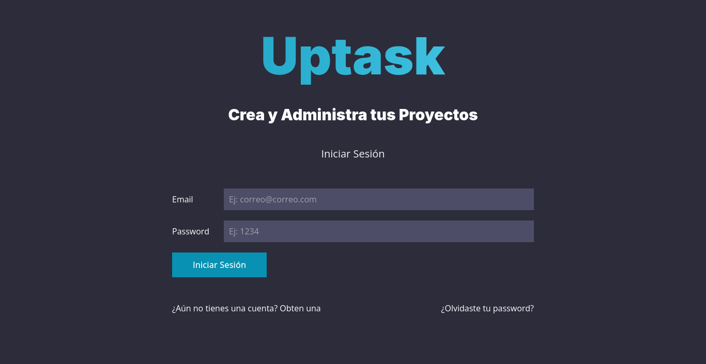

# Proyecto Uptask MVC



## Indice
* [Descripción](#descripción-del-proyecto)
* [Funcionalidades](#funcionalidades-del-proyecto)
* [Tecnologías](#tecnologías-utilizadas)
* [Acceso al proyecto](#acceso-al-proyecto)

## Descripción del proyecto 
Este es un proyecto que busca emular a aplicaciones como Trello, enfocadas en la gestion de proyectos, permitiendo poder establecer estos mismos y asi generar las tareas necesarias para poder llevar acabo los proyectos. Además, de que posee un sistema de filtros, con el proposito de comprobar cuales tareas fueron realizadas y cuales todavia faltan por completar. 


## Funcionalidades del proyecto
- `Modo claro/oscuro (dark mode)`: Cambios entre modo claro e oscuro (depende de las preferencias del navegador).
- `Login de usuario`: Formulario para validación de acceso del usuario.
- `Creación de usuario`: Formulario para crear usuario y validarlo mediante email.
- `Olvido de contraseña`: Formulario para enviar instrucciones de cambio mediante email.
- `Reseteo de contraseña`: Formulario para cambiar la contraseña actual por una nueva.
- `Panel de control`: Panel encargado de mostrar/controlar la información y las acciones presentes en la aplicación.
- `Creación de proyectos`: Acción que tiene como proposito crear cada uno de los proyectos.
- `Creación de tareas`: Acción que tiene como proposito crear cada una de las tareas correspondiente al proyecto.
- `Actualización de tareas`: Se encarga de actualizar la información correspondiente a una tarea del proyecto.
- `Eliminación de tareas`: Acción que tiene como proposito eliminar tareas relacionadas con el proyecto.
- `Filtración de tareas`: Se pueden filtrar las tareas dependiendo de sí fueron completadas o no.
- `Modificación del perfil`: Esta sección se encarga de mostrar como modificar la información relacionada con el perfil del usuario.


## Tecnologías utilizadas
- PHP
- Composer (PHPMailer)
- Javascript
- Sass
- Gulp
- SQL (MariaDB)

## Acceso al proyecto
Para poder hacer uso del proyecto, simplemente debes dirigirte mediante la terminal de comandos o mediante la interfaz gráfica del sistema de archivos de tu preferencia (windows, mac o linux) al directorio `/public` y posteriormente crear el servidor local con PHP

```bash
cd /public
```

```php
php -S localhost:puerto_de_preferencia
```

Con respecto al apartado de los estilos, simplemente debes poner en tu terminal el siguiente comando:

```js
npm install
npm run dev
